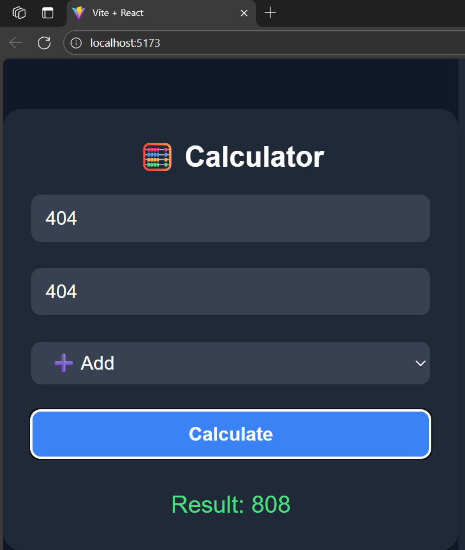
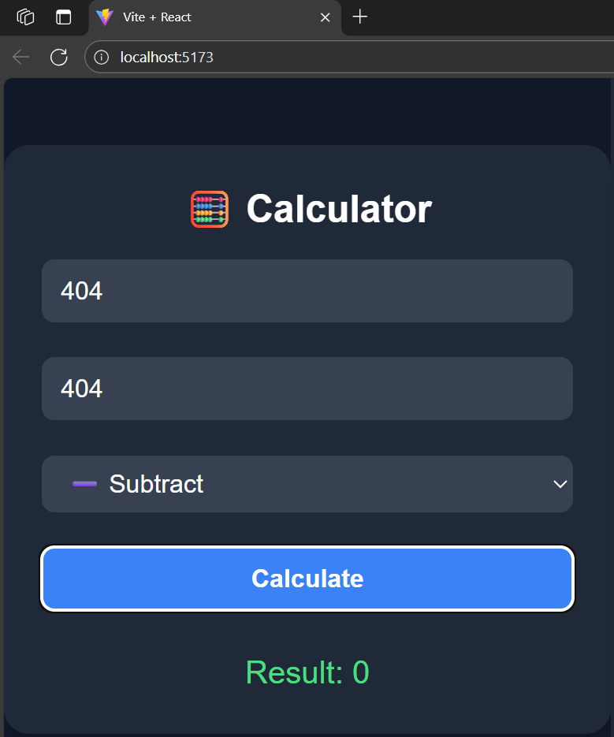
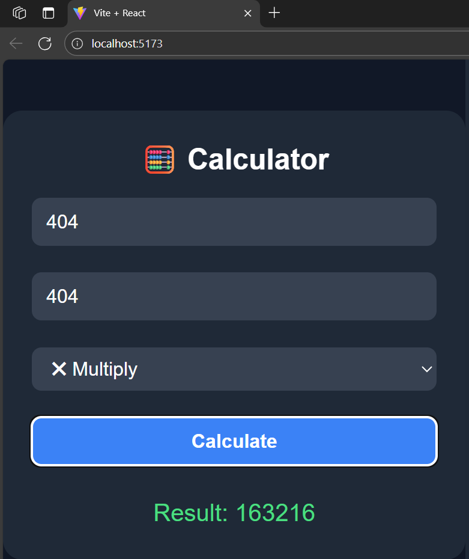
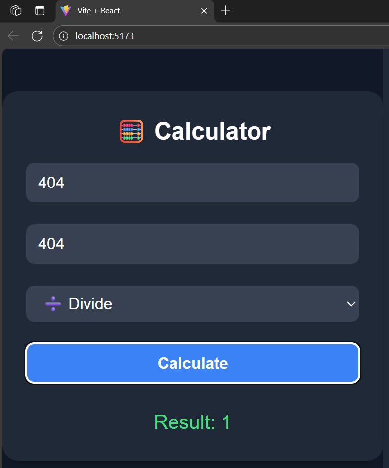

# 🧮 Full Stack Calculator

A responsive, full stack calculator application built with **Spring Boot** (Java backend) and **React + Vite + Tailwind CSS** (frontend). This calculator supports basic arithmetic operations: addition, subtraction, multiplication, and division.

---

## 📸 Preview

| Operation | Output |
|----------|--------|
| ➕ Add |  |
| ➖ Subtract |  |
| ✖ Multiply |  |
| ➗ Divide |  |

---

## ⚙ Tech Stack

### Backend (Spring Boot)
- Java 24
- Spring Boot
- REST Controller (`@RestController`)
- CORS enabled for frontend requests

### Frontend (React + Vite)
- React
- Tailwind CSS
- Vite
- Axios (for API calls)

---

## 📂 Project Structure

'''text
FullStackCalculator/
├── backend/ # Spring Boot backend
│ └── src/
│ └── com.example.calculator/
│ ├── controller/CalculatorController.java
│ └── model/OperationRequest.java
├── frontend-calculator/ # React frontend
│ ├── src/
│ │ ├── App.jsx
│ │ ├── index.css
│ ├── tailwind.config.js
│ └── vite.config.js
├── images/ # Screenshots of output
│ ├── Addition.png
│ ├── Subtraction.png
│ ├── Multiplication.png
│ └── Division.png
---


## 🚀 Running the App

### 1. Start Backend (Spring Boot)
Ensure you have Java and Maven installed.

```bash
cd backend
mvn spring-boot:run
```
The backend will run on:
📍 http://localhost:8080/api/calculator

---

### 2. Start Frontend (React + Vite)

```bash
cd frontend-calculator
npm install
npm run dev
```
Frontend runs on:
📍 http://localhost:5173
---

##📡 API Endpoint
POST /api/calculator/calculate
| In Postman |  |
---
##🔐 CORS Configuration

The backend allows requests from the frontend using:
@CrossOrigin(origins = "http://localhost:5173")
---
##💻 Author
Developed by Madhuchhanda Das aka latenightcoder-git as part of a full-stack project with Spring Boot and React.

